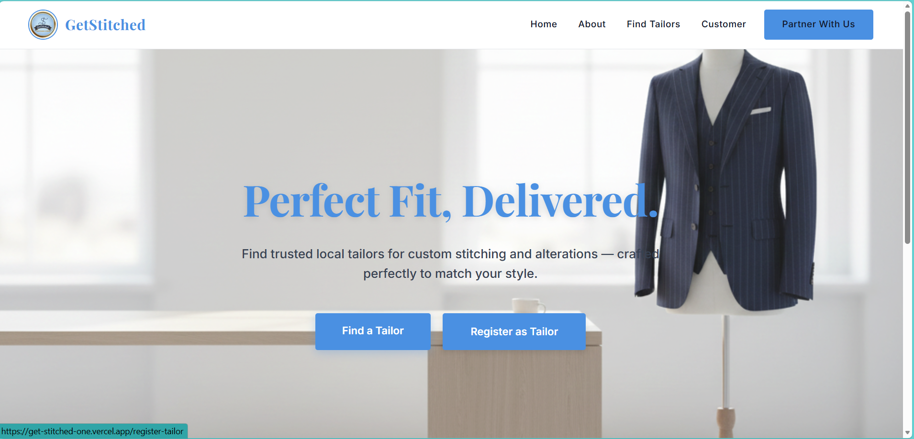
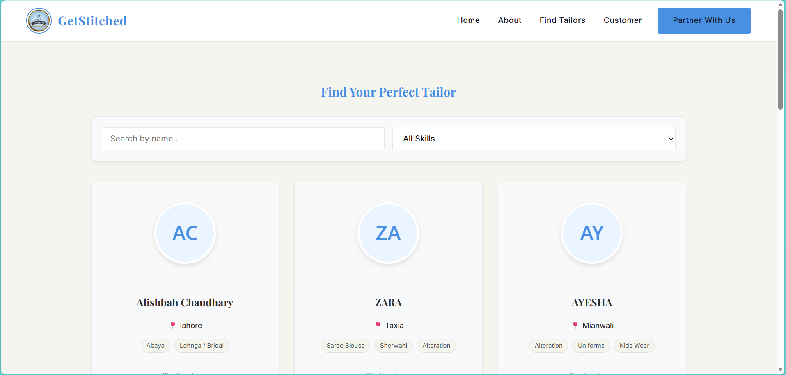
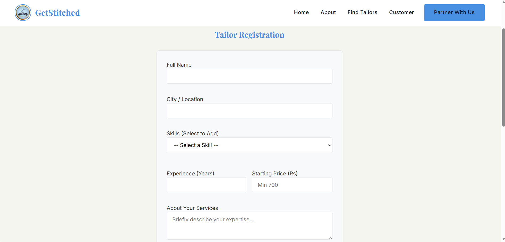
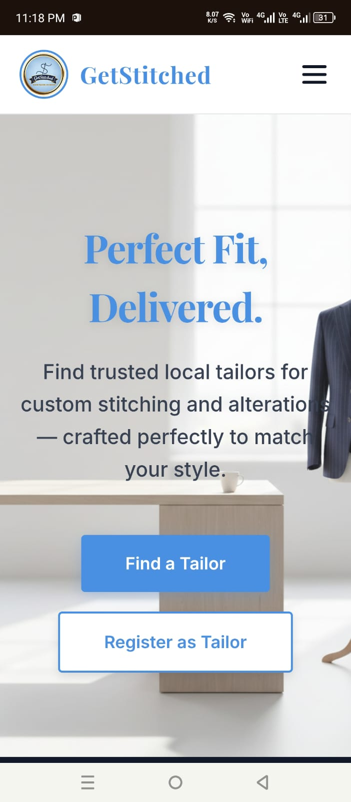

# 🧵 GetStitched — Find Your Perfect Tailor

> Connecting customers with skilled local tailors across Pakistan — built with the MERN Stack.

[](https://get-stitched-one.vercel.app)
[](https://vercel.com)
[](https://railway.app)

---

## 📌 Problem Statement

In Pakistan, finding a reliable local tailor is a major challenge — especially during Eid season when tailors are overwhelmed and often refuse new orders. There is no centralized platform where:
- Customers can **discover nearby tailors** by skill or location
- **Housewives and home-based workers** can register and offer their stitching services
- People can **compare prices** before committing to a tailor

**GetStitched** solves this by providing a marketplace connecting customers with tailors — making the process transparent, accessible, and efficient.

---

## 🌐 Live Demo

🔗 **[https://get-stitched-one.vercel.app](https://get-stitched-one.vercel.app)**

---

## 📸 Screenshots

### Home Page


### Find Tailors


### Tailor Registration


### Mobile View


---

## ✨ Features

- 🔍 **Browse Tailors** — View all registered tailors with their skills, experience, location, and pricing
- 🎯 **Smart Filtering** — Filter tailors by name or skill (Shalwar Kameez, Bridal, Alterations, etc.)
- 📝 **Tailor Registration** — Any tailor or home-based worker can register and list their services
- 👤 **Customer Sign Up** — Customers can create accounts to request services
- 📱 **Fully Responsive** — Works seamlessly on mobile, tablet, and desktop
- 🚀 **Full Stack Deployed** — Frontend on Vercel, Backend on Railway, Database on MongoDB Atlas

---

## 🛠️ Tech Stack

| Layer | Technology |
|-------|-----------|
| Frontend | React.js, React Router, Axios |
| Backend | Node.js, Express.js |
| Database | MongoDB Atlas (Mongoose) |
| Deployment | Vercel (Frontend), Railway (Backend) |
| Styling | CSS3, Lucide React Icons |

---

## 🏗️ Project Structure

```
GetStitched/
├── Backend/
│   ├── config/
│   │   └── db.js
│   ├── controllers/
│   │   ├── tailorController.js
│   │   ├── userController.js
│   │   └── bookingController.js
│   ├── models/
│   │   ├── Tailor.js
│   │   ├── User.js
│   │   └── Booking.js
│   ├── routes/
│   │   ├── tailorRoutes.js
│   │   ├── userRoutes.js
│   │   └── bookingRoutes.js
│   └── server.js
├── src/
│   ├── Components/
│   │   ├── NavBar.jsx
│   │   ├── Hero.jsx
│   │   ├── TailorCard.jsx
│   │   └── Footer.jsx
│   ├── pages/
│   │   ├── Home.jsx
│   │   ├── TailorList.jsx
│   │   ├── RegisterTailor.jsx
│   │   └── RegisterCustomer.jsx
│   └── App.jsx
├── vercel.json
└── README.md
```

---

## 🚀 Getting Started Locally

### Prerequisites
- Node.js v18+
- MongoDB Atlas account
- Git

### 1. Clone the repository
```bash
git clone https://github.com/alishbahbsse4658-alt/GetStitched.git
cd GetStitched
```

### 2. Setup Backend
```bash
cd Backend
npm install
```

Create a `.env` file in the `Backend` folder:
```env
MONGO_URI=your_mongodb_connection_string
PORT=5000
```

Run the backend:
```bash
npm start
```

### 3. Setup Frontend
```bash
cd ..
npm install
```

Create a `.env` file in the root folder:
```env
VITE_API_URL=http://localhost:5000
```

Run the frontend:
```bash
npm run dev
```

---

## 🔌 API Endpoints

| Method | Endpoint | Description |
|--------|----------|-------------|
| GET | `/api/tailors` | Get all tailors |
| POST | `/api/tailors` | Register a new tailor |
| GET | `/api/tailors/:id` | Get tailor by ID |
| PUT | `/api/tailors/:id` | Update tailor profile |
| DELETE | `/api/tailors/:id` | Delete tailor |
| POST | `/api/users` | Register a customer |
| POST | `/api/bookings` | Create a booking |

---

## 🔮 Future Enhancements

- ⭐ **Ratings & Reviews** — Customers can rate and review tailors
- 💳 **Online Payments** — Integrated payment gateway (JazzCash / EasyPaisa)
- 📍 **Location-based Search** — Find tailors near you using maps
- 💬 **Real-time Chat** — Direct messaging between customers and tailors
- 📊 **Tailor Dashboard** — Analytics and order management for tailors

---

## 👩‍💻 Author

**Alishbah Chaudhary**

[](https://github.com/alishbahbsse4658-alt)

---

## 📄 License

This project is open source and available under the [MIT License](LICENSE).